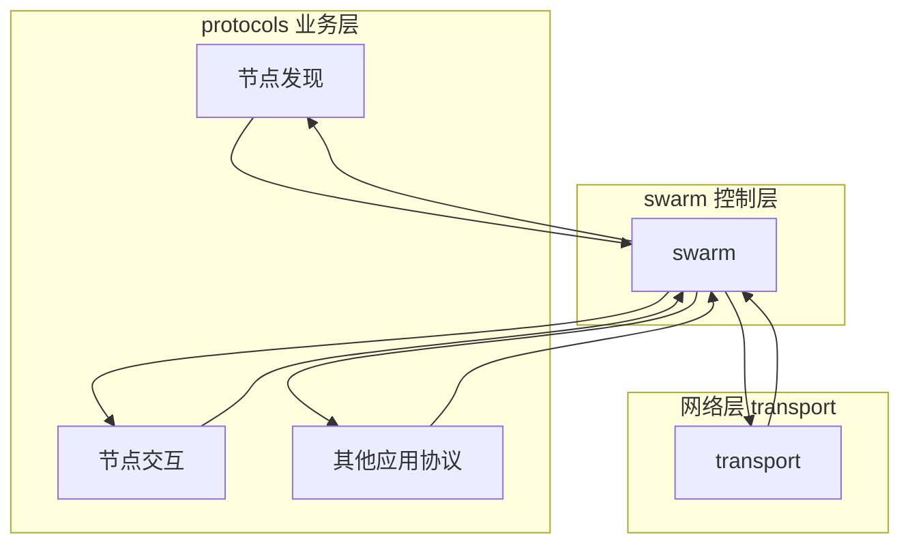
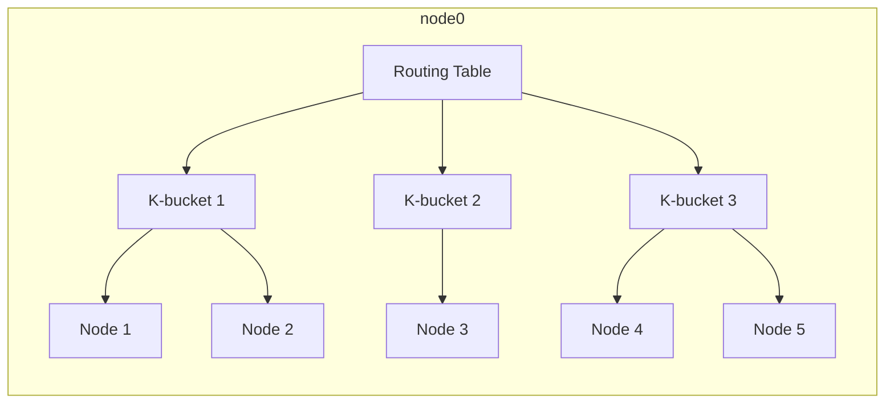
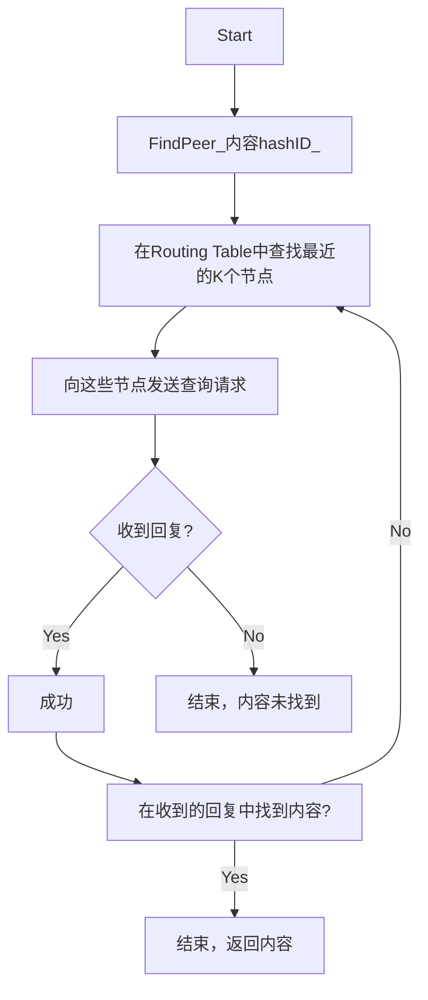

# libp2pNote

## 架构

swarm 控制层
负责将transport和protocols结合起来，类似于controller

## 核心概念
### multiaddress 
/ip4/7.7.7.7/tcp/6543

### PeerId
/ip4/1.2.3.4/tcp/4321/p2p/QmcEPrat8ShnCph8WjkREzt5CPXF2RwhYxYBALDcLC1iV6

/p2p/QmcEPrat8ShnCph8WjkREzt5CPXF2RwhYxYBALDcLC1iV6
使用其公钥的哈希【hash】来唯一的标识一个远程端点

### Circuit Relay

### Protocals
唯一的字符串标识符，在首次打开连接时用于协议协商过程
/my-app/amazing-protocol/1.0.1

### swarm 
处理协议函数

### 常见协议
Ping
/ipfs/ping/1.0.0

Identify【识别协议】
/ipfs/id/1.0.0

kad-dht
/ipfs/kad/1.0.0

relay
/libp2p/circuit/relay/0.1.0

### PeerID
对方公钥的hash
QmYyQSo1c1Ym7orWxLYvCrM2EmxFTANf8wXmmE7DWjhx5N

/ip4/7.7.7.7/tcp/4242/p2p/QmYyQSo1c1Ym7orWxLYvCrM2EmxFTANf8wXmmE7DWjhx5N

## Kad-DHT过程
### 节点
**NodeID**:160 bit hash
**Node distance**: 每个节点存着自己最近节点的信息.这里的最近(Nearest) 使用XOR来确定，既共同前缀越多越近
**K bucket**:分距离来保存节点列表（使用trie实现）
**Routing table**:保存所有的buckets,每个buckets最多保存k个节点

查询过程的时间复杂度是LogN
心跳节点来更新Routing table

### 内容
将内容也做一个160 bit的内容hash

### 存储
将内容放在距离内容hash最近的NodeID节点上

### 查找
FindPeer(内容hashID)

## 广播
支持pubsub和gossip
blockchain使用的是gossip进行广播