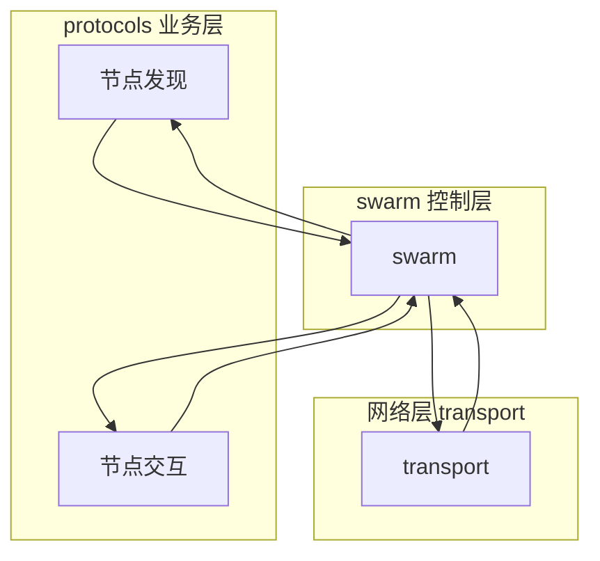
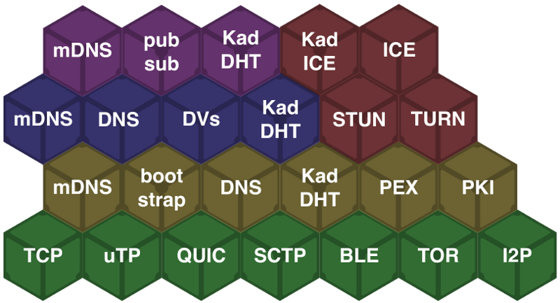

# libp2pNote

```mermaid
graph TB
    subgraph protocols 业务层
        nodeDiscovery[节点发现]
        nodeInteraction[节点交互]
    end
    subgraph swarm 控制层
        swarm[swarm]
    end
    subgraph 网络层 transport
        transport[transport]
    end
    transport-->swarm
    swarm-->transport
    swarm-->nodeDiscovery
    nodeDiscovery-->swarm
    swarm-->nodeInteraction
    nodeInteraction-->swarm
```

## 架构
